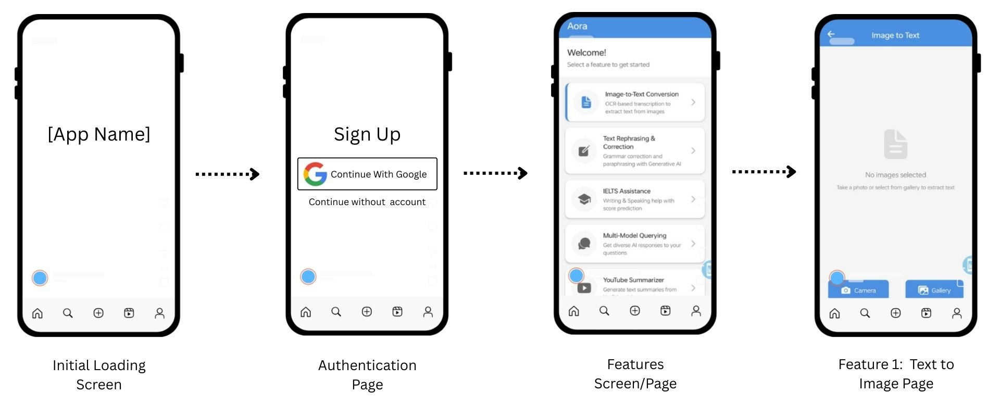

# Aora - AI-Powered Mobile App



## Overview

Aora is a cutting-edge mobile application built with React Native that brings powerful AI capabilities to your fingertips. Designed for both productivity and creativity, Aora offers a seamless mobile experience with advanced features.

## Features

- **Image-to-Text Conversion**: OCR-based transcription to extract text from images
- **Text Rephrasing & Correction**: Grammar correction and paraphrasing with Generative AI
- **IELTS Assistance**: Writing & Speaking help with score prediction
- **Multi-Model Querying**: Get diverse AI responses to your questions
- **YouTube Summarizer**: Generate text summaries from YouTube videos
- **AI Chat Assistant**: Intelligent conversations with context-aware responses. (Coming Soon)
- **Image Generation**: Create stunning visuals with AI-powered art generation. (Coming Soon)
- **Voice Commands**: Control the app hands-free with voice recognition. (Coming Soon)
- **Multi-Language Support**: Communicate in various languages with real-time translation. (Coming Soon)

## Getting Started

### Prerequisites

- Node.js 16 or higher
- React Native development environment
- Android Studio or Xcode (for emulator/simulator)

### Installation

1. Clone the repository:
```bash
git clone https://github.com/yourusername/aora.git
cd aora
```

2. Install dependencies:
```bash
npm install
```

3. Run the application:
```bash
npx react-native run-android
# or
npx react-native run-ios
```

## Usage

1. Launch the app on your device or emulator
2. Create an account or sign in
3. Explore the dashboard to access various AI tools
4. Select a feature and follow the on-screen instructions

## API Options

The application supports integration with:
- OpenAI
- Gemini
- Mistral
- Custom API endpoints

## Contributing

We welcome contributions! Please fork the repository and submit a Pull Request with your improvements.

## License

This project is licensed under the MIT License - see the LICENSE file for details.

