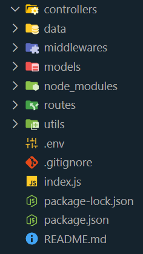

Important packages used in the project:

1. express
2. mongodb
3. cors
4. morgan
5. dotenv
6. nodemon
7. cookie-parser
8. multer
9. colors

**Command**: `npm i express mongodb cors nodemon cookie-parser morgan dotenv multer colors`

1. What is middleware?  
   👉 Which let or authorize upcoming or next functions if everything is fine. In simple terms middlewares are the next functions that are responsible for other task after the current task.

2. What is the **.env** file?  
   👉 The .env file is a file that keeps all the confidential data.

3. MVC pattern and folder structure for the application  
   👉 MVC refers to Model-View-Controller. An architecture that is followed by most Node JS projects.
   The **M** refers to Models or database design, **V** refers to View or frontend or client side and **C** refers to Controller or logical part of the backend codebase. Here in the controller folder callback functions would be defined. Here is the common folder structure

    

4. 
