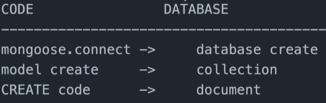

> # **`Backend development`**

Backend development comprises **database** and **server**.

-   Node.js is single threaded but non-blocking.

Modules in Node.js: Modules are functions and there are three types of modules available in node js,

1. Built in modules
2. Third party modules (install via NPM js)
3. File based modules

&nbsp;

> # **`NPM commands`**

flag `-g`: describes package to install globally.

&nbsp;

> # `Working with Express.js`

Express.js is a framework for Node.js that is used to create backend servers with ease.

## <p align="center"><b>Create Express.js Project</b></p>

To create an Express.js project, follow these steps:

1.  Run the command to initialize the Node Package Manager(NPM):  
     `npm init -y`  
    **(1.1)** This command creats an package.json file into the directory you've initialized the project.

2.  Install express js package and nodemon package together by running this command:  
    `npm install express nodemon`  
    An alternative command is:  
    `npm i express nodemon`  
    **(2.1)** instead of 'install' keyword we can use 'i'  
    **(2.2)** nodemon is a package that let us track change and show new changes realtime without restarting the server again and again  
    **(2.3)** to install multiple package you have to write the package name after 'npm install' or 'npm i' that you want to install.

3.  **Use .gitignore to exclude node_modules.**  
     Node modules are libraries that are hefty size. So, it is not a good idea to add those node modules to your github repository. To not include node_modules into your github repo,  
    **(3.1)** <ins>first of all create a file with name `.gitignore`</ins>  
    **(3.2)** In the .gitignore file write the directory you want to exclude, in the case we have to exclude node_modules folder. So, we will write `node_modules/`
4.  The basic command to run an express project using nodemon package is: `nodemon index.js`  
    But, you can change the long command by do the following:  
     **(4.1)** Go to package.json file  
     **(4.2)** You'll see this object:

        ```
        "scripts": {
            "test": "echo \"Error: no test specified\" && exit 1"
        }
        ```

        **(4.3)** Replace above code with this:

        ```
        "scripts": {
            "test": "echo \"Error: no test specified\" && exit 1",
            "start": "nodemon index.js"
        },
        ```

        The line "start": "nodemon index.js" will let you replace long command **nodemon index.js** with
        ```npm start```

## **🤔 What is Port?**

👉 Port is is endpoint (URL of a server) or more specificly a number where your express application should run or listen to. **The default port of epxress is \***port 3000**\*.** You access the server at <http://localhost:3000> in your web browser.

We can change our port as our preference by specifying the port number as an argument to the listen() method.

```jsx
/// import express module to utilize
import express from "express";
const app = express();
const CORS = require("cors");
/// Your application will serve at http://localhost:PORT
/// process.env.PORT is a variable where port value is declared in .env file, it is a good practice to store credentials like port in .evn file
const PORT = process.env.PORT || 5500;

app.get("/", (req, res) => {
    res.send("Hello World!");
});

app.use(CORS());

app.listen(port, () => {
    console.log(`Server running at port ${PORT}`);
});
```

To execute the aforementioned application, carry out step 4 of **Create Express.js Project**.

## **`Error`**

<ins>Error message:</ins> **..\nodemon.ps1 cannot be loaded because running scripts is disabled on this system.**

Operating system: Windows 11

**Fix: <https://stackoverflow.com/questions/63423584/how-to-fix-error-nodemon-ps1-cannot-be-loaded-because-running-scripts-is-disabl>**

Other Notes:

1. How to update a package: `npm update <your_package_name>`
2. The **index.js** file should be simple and clean, it should mainly contain server listen methods.

&nbsp;

## **`CORS Error`**

## **`POST Request`**

POST request মানে হচ্ছে client or frontend থেকে server এ কোন data পাঠানো, যেমন কোন form submit করলে user এর submitted data server এ যায় ।

<details>
<summary>Steps</summary>

1. By default or implicitly every request sent as 'GET' request in node js.
2. Use fetch with method POST.
3. Add headers to the fetch. "content-type": "application/json"
4. Add body to the fetch to send data and make sure to use JSON.stringify to send data.
5. Make sure adding this line: app.use(express.json())
 </details>

## **`Modules`**

Modules are simply functions.

### **Import and export module by 'import' and 'export' keyword**

Add `"type": "module",` in your package.json file object.

-   to export multiple modules export them as an object.

```javascript
const moduleA = "moduleA";
const moduleB = "moduleB";
const moduleC = "moduleC";

export { moduleA, moduleB, moduleC };
```

## **`When to use NoSQL`**

-   Suitable for data heavy application and scalability (popular for horizontal it's scalability model).
-   NoSQL databases are designed to handle unstructured data.
-   User for encouraging application paradigm like microservices and real-time streaming.
-   If the service requires a scale-out architecture.
-   Optimized for specific data types, often offering faster read/write speeds for certain queries.
-   Has rich features like: indexing, aggregation, file store, etc.

## **`CRUD Operations`**

1. C = Create
2. R = Read
3. U = Update
4. D = Delete

## **`Middleware`**

-   Middleware এমন একটা logic যেটা request response cycle এর মাঝে থাকে ।
-   প্রতিবার কোন route hit করতে হলে সেটা একটা middleware হয়ে যায় ।
-   Middleware sits between application logic and the server. **Bridge between client and server.**
-   Middleware is an interceptor between request and response cycle. Why do we require an interceptor? Since not every request is valid and an application could have it's own way to handle or specific criteria to handle or process the request then proceed to the response.
-   In Express JS middleware holds the access of request and response. If particular request failed it will not proceed to the next task.
-   Middleware deals with various task such as:
    -   Request response process
    -   Authentication and Authorization
    -   Logging and Monitoring
    -   CORS Handling
    -   Error Handling
    -   Session Management
-   Express middleware maintains top-down approach that means they will execute one after another. Unless the current middleware get successfully executed it will not go to the next one.
-   Usually middlewares in express don't send response.

### 3rd party middleware

### **`Morgan`**

A HTTP request logger middleware for Node.js. It logs details about incoming requests to your server.

> ## **`Notes`**

1. Post method দিয়ে কোন ডাটা পাঠানো হলে সেটা body object এর মধ্যে আসে । আর data দেখতে হলে req.body দিয়ে দেখতে হবে ।

2. By default HTML form methods are in 'GET' method, to submit to the server we've to change it to the POST method.

3. req.body থেকে কোন data দেখতে হলে অবশ্যই নিচের দুটি express middleware add করতে হবে

    ```cpp
    app.use(express.json());
    app.use(express.urlencoded({ extended: true }));
    ```

4. Static files are the non-credential files rendered directly to the client's browser that don't required any server-side processing. These files are typically the frontend related files (like HTML, CSS, JS, Images, etc). Direct access, no authentication or restriction. To use static file add the following code:

    ```cpp
    app.use(express.static("public"));
    ```

> ## **`MongoDB`**

1. **SQL** - Data stored in tabular format.
2. **NoSQL** - Not Only SQL, stores data in object format.

### NoSQL terminologies

Backend contains two parts, these are:

-   **Application server**: Where all logic of the backend is written. Handle routes, accepts request.
-   **Database server**: Where all the data are stored.

Collections, documents, schemas, keys, models

1. **Cluster**: A place in mongodb where many database are saved.
2. **Database**: Where data of a specific project is saved.
3. **Collections**: Collections are just like tables in relational databases, they also store data, but in the form of documents. MongoDB stores data records as documents (specifically BSON documents) which are gathered together in collections. A collection can have multiple documents.
4. **Documents**: The format or style of the data that is consumed by mongodb collections. Documents are a data structure composed of field and value pairs just like JSON objects.
5. **Schema**: It's a structure that tells how your document should look like. By default NoSQL like mongodb are schemaless, they are developed to be schema flexible. But as project grows our database should maintain a strict structure thus tools like Mongoose comes into picture providing a schema to NoSQL databases like mongodb. **Mongoose schemas are how you tell Mongoose what your documents look like.**

    


-   Mongoose is a **ODM(Object Document Mapping)**


